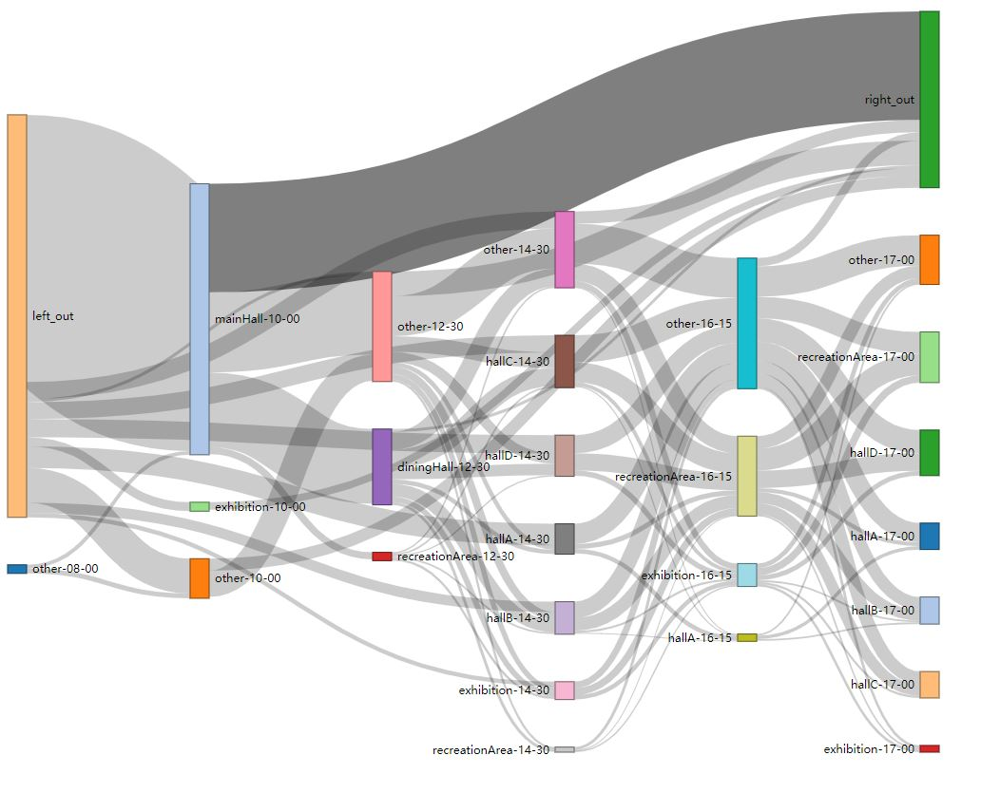
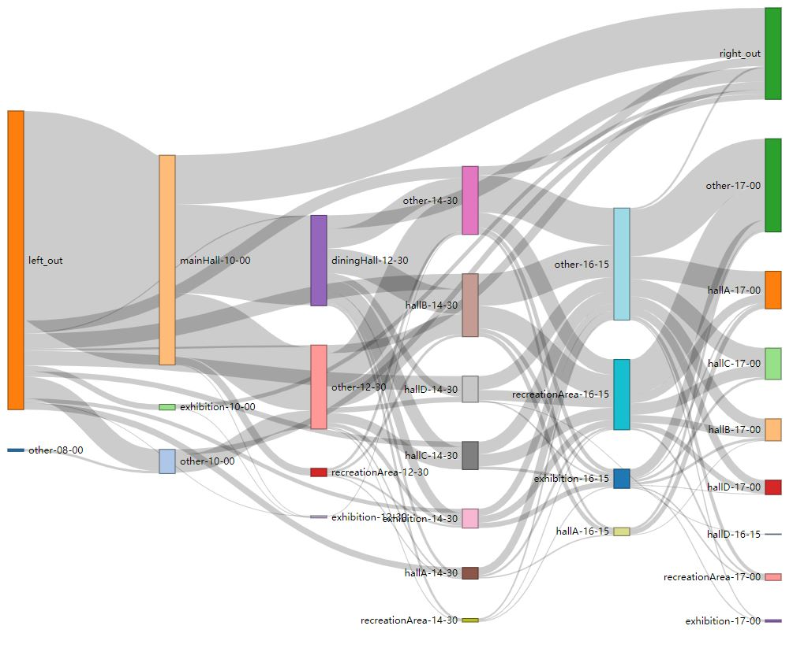
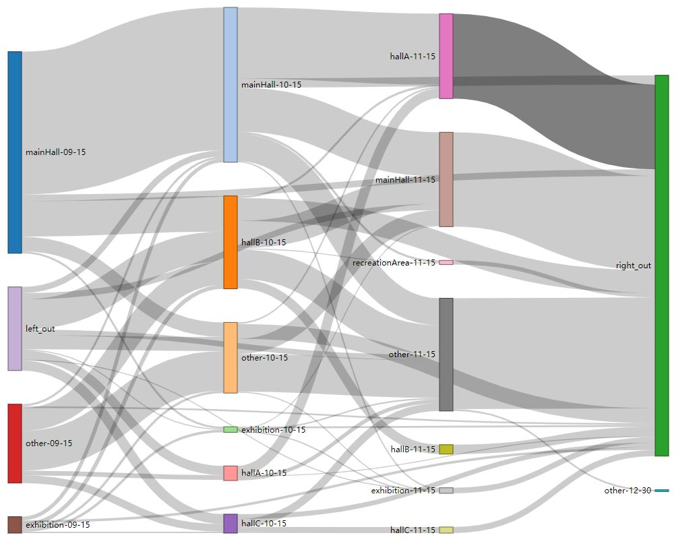

# chinaVis19

Updated by Kangjie Xu on May 25th

data file:

* data/route.csv 每个人每分钟的位置

  * route.csv 是第一天的数据，共720分钟(7:00 - 19:00)
  * route2.csv为第二天数据，共782分钟(7:00 - 19:02)
  * route3.csv为第二天数据，共782分钟(7:00 - 19:02)，虽然没有782分钟，但我还是用了782列。

* data analysis/route Classify.py 主要分析文件

  * 函数说明
  * 有判断区域的类
  * 有生成route的data
  * compute distances 好像已经没什么用了，虽然算了一天。

* sankey 图

  * 其实我现在想，这些图放在页面上说明说明什么问题。。好像对解题似乎没有太大帮助。。。？？
  * 区域分类说明
    * out 指场馆外， other 指除了图示会议厅，dining hall， recreation area， exhibition之外的地方。
  * try.html:第一天，取 8:00 - 10:00 - 12:30 - 14:30 - 16:15 - 17:00 - flow
  * 

  * try2.html : 第二天  8:00 - 10:00 - 12:30 - 14:30 - 16:15 - 17:00 - flow
    * 
  * try3.html 第三天的数据  9: 15  - 10:15 - 11: 15 - 12:30
  * 

Updated by Kangjie Xu on May 15th

crowd counting

| Day              | 1    | 2    | 3    |
| ---------------- | ---- | ---- | ---- |
| number of people | 3564 | 4434 | 2930 |

