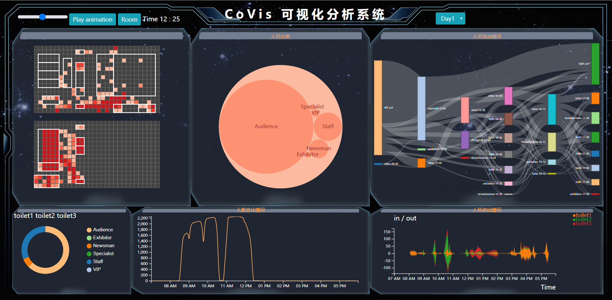
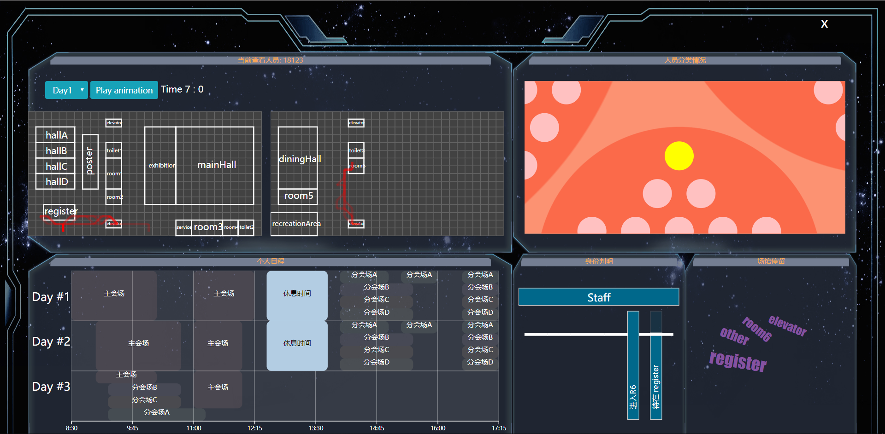

# ChinaVis19

A visualization project for [ChinaVis 2019](http://www.chinavis.org/2019/challenge.html).

```shell
├─analysis										# data analysis
├─css											# frontend css
├─data											# data
│  └─data_sankey	
├─img		
├─js											# frontend js
│  └─api
├─regulization									# data process
├─server										# backend
│  └─src										
│      ├─controller								# MVC-model
│      ├─model									# MVC-controller
│      └─utils
├─sql											# pymysql
└─分类
```

```shell
# frontend
http-server . # python -m http.server

# backend
cd server
npm install
npm run server
```






